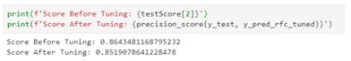

# Hotel Booking Cancellations Prediction

This project aims to predict hotel booking cancellations. By knowing the guest who is likely to cancel, the hoteliers can do actions to avoid the cancellations, calculate the right demand, or adjust their overbooking tactics and cancellation policies appropriately to increase the revenue. 

This project includes the flask dashboard called Bell-Man (Booking cancellation prediction machine) which contain some visualizations of the data and the prediction machine itself.

## Data Dictionary
|VARIABLE                       |TYPE      |DESCRIPTION |
|:------------------------------|:---------|:-----------|
|__hotel__                      |character | Hotel (H1 = Resort Hotel or H2 = City Hotel) |
|__is_canceled__                |double    | Value indicating if the booking was canceled (1) or not (0) |
|__lead_time__                  |double    | Number of days that elapsed between the entering date of the booking into the PMS and the arrival date |
|__arrival_date_year__          |double    | Year of arrival date|
|__arrival_date_month__         |character | Month of arrival date|
|__arrival_date_week_number__   |double    | Week number of year for arrival date|
|__arrival_date_day_of_month__  |double    | Day of arrival date|
|__stays_in_weekend_nights__   |double    | Number of weekend nights (Saturday or Sunday) the guest stayed or booked to stay at the hotel |
|__stays_in_week_nights__       |double    |  Number of week nights (Monday to Friday) the guest stayed or booked to stay at the hotel|
|__adults__                     |double    | Number of adults|
|__children__                   |double    | Number of children|
|__babies__                     |double    |Number of babies |
|__meal__                       |character | Type of meal booked. Categories are presented in standard hospitality meal packages:   Undefined/SC – no meal package; BB – Bed & Breakfast;   HB – Half board (breakfast and one other meal – usually dinner);   FB – Full board (breakfast, lunch and dinner) |
|__country__                    |character | Country of origin. Categories are represented in the ISO 3155–3:2013 format |
|__market_segment__             |character | Market segment designation. In categories, the term “TA” means “Travel Agents” and “TO” means “Tour Operators” |
|__distribution_channel__       |character | Booking distribution channel. The term “TA” means “Travel Agents” and “TO” means “Tour Operators” |
|__is_repeated_guest__          |double    | Value indicating if the booking name was from a repeated guest (1) or not (0) |
|__previous_cancellations__     |double    | Number of previous bookings that were cancelled by the customer prior to the current booking |
|__previous_bookings_not_canceled__ |double    | Number of previous bookings not cancelled by the customer prior to the current booking |
|__reserved_room_type__         |character | Code of room type reserved. Code is presented instead of designation for anonymity reasons |
|__assigned_room_type__         |character | Code for the type of room assigned to the booking. Sometimes the assigned room type differs from the reserved room type due to hotel operation reasons (e.g. overbooking) or by customer request. Code is presented instead of designation for anonymity reasons |
|__booking_changes__            |double    | Number of changes/amendments made to the booking from the moment the booking was entered on the PMS until the moment of check-in or cancellation|
|__deposit_type__               |character | Indication on if the customer made a deposit to guarantee the booking. This variable can assume three categories: No Deposit – no deposit was made; Non Refund – a deposit was made in the value of the total stay cost; Refundable – a deposit was made with a value under the total cost of stay. |
|__agent__                      |character | ID of the travel agency that made the booking |
|__company__                    |character | ID of the company/entity that made the booking or responsible for paying the booking. ID is presented instead of designation for anonymity reasons |
|__days_in_waiting_list__       |double    | Number of days the booking was in the waiting list before it was confirmed to the customer |
|__customer_type__              |character | Type of booking, assuming one of four categories: Contract - when the booking has an allotment or other type of contract associated to it; Group – when the booking is associated to a group; Transient – when the booking is not part of a group or contract, and is not associated to other transient booking; Transient-party – when the booking is transient, but is associated to at least other transient booking|
|__adr__                        |double    | Average Daily Rate as defined by dividing the sum of all lodging transactions by the total number of staying nights |
|__required_car_parking_spaces__|double    | Number of car parking spaces required by the customer |
|__total_of_special_requests__  |double    | Number of special requests made by the customer (e.g. twin bed or high floor)|
|__reservation_status__         |character | Reservation last status, assuming one of three categories: Canceled – booking was canceled by the customer; Check-Out – customer has checked in but already departed; No-Show – customer did not check-in and did inform the hotel of the reason why |
|__reservation_status_date__    |double    | Date at which the last status was set. This variable can be used in conjunction with the ReservationStatus to understand when was the booking canceled or when did the customer checked-out of the hotel|

## Data Preparation
#### 1. Drop Rows with Missing Values
children, country, market_segment, distribution_channel 
#### 2. Modifying Columns
total_guests = adults + children + babies
#### 3. Remove Wrong Values
- adr feature has negative value. It does not make sense if the price is negative. 
- total_guests has the value of 0. It does not make sense if no one booked the room.
#### 4. Drop Features
Considering: percentage of null values,  information contained, high correlation with other features

## Modeling
#### 1. Preprocessing
Using Pipeline: constant imputer and binary encoder for categorical data, robust scaler for numerical data, smote

#### 2. Modeling with Default Parameters
Six models are used: Logistic Regression, DTC, RFC, Gradient Boosting Classifier, XGB Classifier, KNN. The two best models are __RFC and XGB__

#### 3. Modeling with Default Parameters + RFE in Pipeline
The test score using RFE is slightly drop from the non-RFE model and RFC model still has the best score 

#### 4. Hyperparameter Tuning RFC
The tuning is failed to make the score better. So, the default parameter RFC model pipeline will be used

#### 5. Threshold Adjustment
The threshold of 0.590833 increase precision score as much as almost 4% while losing recall score 5.7%

## Dashboard
#### Homepage

#### Dataset Page

#### Visualization Page

#### Predict and Result

